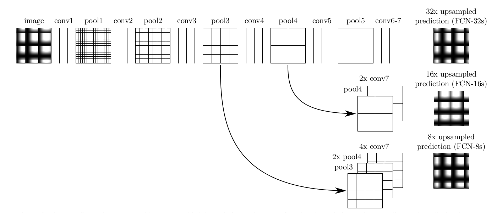

# Semantic Segmentation
Udaicty self-driving car engineer nanodegree.
The udacity project solution. 
### Introduction
In this project, you'll label the pixels of a road in images using a Fully Convolutional Network (FCN).
We use the FCN based on the VGG-16 image classifier architecture for semantic segmentation with some data from [kitti data set(both with trainning and testing)](
Download the [Kitti Road dataset](http://www.cvlibs.net/datasets/kitti/eval_road.php) from [here]().
## Architecture
### Main ideas
The layers 3, 4 and 7 of VGG16 are utilized in creating skip layers, and we can find the reasons in [this paper](https://arxiv.org/pdf/1605.06211.pdf).


We get the VGG-16 model which is [pre-trainned](https://s3-us-west-1.amazonaws.com/udacity-selfdrivingcar/vgg.zip).
And use the AdamOptimizer, the loss function is cross_entropy loss. 
The hyperparameters are as below:

hyperparameters | values
--------------- | ---------------------
learning_rate   |  0.00001
keep_prob       |  0.5
epochs          |  48
batch_size      |  5

### Result
There are some result for the Semantic Segmentation in test images:

### Setup
##### GPU
`main.py` will check to make sure you are using GPU - if you don't have a GPU on your system, you can use AWS or another cloud computing platform.
##### Frameworks and Packages
Make sure you have the following is installed:
 - [Python 3](https://www.python.org/)
 - [TensorFlow](https://www.tensorflow.org/)
 - [NumPy](http://www.numpy.org/)
 - [SciPy](https://www.scipy.org/)

You may also need [Python Image Library (PIL)](https://pillow.readthedocs.io/) for SciPy's `imresize` function.
I install it in this way: 
```
pip3 install -r requirements.txt
```
##### Dataset
Download the [Kitti Road dataset](http://www.cvlibs.net/datasets/kitti/eval_road.php) from [here](http://www.cvlibs.net/download.php?file=data_road.zip).  Extract the dataset in the `data` folder.  This will create the folder `data_road` with all the training a test images.

### Start
##### Implement
Implement the code in the `main.py` module indicated by the "TODO" comments.
The comments indicated with "OPTIONAL" tag are not required to complete.
##### Run
Run the following command to run the project:
```
python main.py
```
**Note:** If running this in Jupyter Notebook system messages, such as those regarding test status, may appear in the terminal rather than the notebook.

